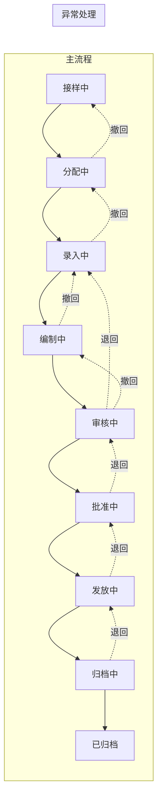

# 流程与功能对齐 — lab-management-system

> 人填、人评审。机器只检查引用的功能 ID 是否存在。
> 评审时把流程图投出来，逐行念「这一步靠哪些功能完成」。念不出来的行，
> 要么流程是空的，要么功能是缺的，这就是对齐的全部意义。

## FLOW-01 试验流程（主流程）

### 状态定义

| 状态 | 说明 | 可执行操作 |
|---|---|---|
| 接样中 | 正在填写接样单信息 | 保存、提交、撤回 |
| 分配中 | 接样单已提交，等待任务分配 | 保存、提交、退回、撤回 |
| 录入中 | 任务已分配，等待检测数据录入 | 保存、提交、退回、撤回 |
| 编制中 | 检测数据已录入，等待报告编制 | 保存、提交、退回、撤回 |
| 审核中 | 报告已编制，提交审核 | 保存、提交、退回、撤回 |
| 批准中 | 审核通过，等待批准 | 保存、提交、退回、撤回 |
| 发放中 | 批准通过，等待发放 | 保存、提交、退回、撤回 |
| 归档中 | 报告已发放，等待归档 | 保存、提交、退回、撤回 |
| 已归档 | 报告归档完成，流程结束 | - |

### 状态流转图

### 步骤与功能映射

| 步骤 | 状态 | 角色 | 支撑功能子项 |
|---|---|---|---|
| F01 | 接样中 | technician | M03.F01.I01, M03.F01.I02, M03.F01.I03, M03.F01.I04, M03.F01.I05 |
| F02 | 分配中 | technician | M03.F02.I01, M03.F02.I02 |
| F03 | 录入中 | technician | M03.F03.I01, M03.F03.I02, M03.F03.I03, M03.F03.I04, M03.F03.I05, M03.F03.I06 |
| F04 | 编制中 | technician | M03.F04.I01, M03.F04.I02, M03.F04.I03, M03.F04.I04 |
| F05 | 审核中 | admin/审核员 | M03.F05.I01, M03.F05.I02, M03.F05.I03 |
| F06 | 批准中 | admin/批准员 | M03.F06.I01, M03.F06.I02, M03.F06.I03 |
| F07 | 发放中 | admin/发放员 | M03.F07.I01, M03.F07.I02, M03.F07.I03 |
| F08 | 归档中 | admin/归档员 | M03.F08.I01, M03.F08.I02, M03.F08.I03 |
| F09 | 已归档 | - | 流程结束 |

### 操作说明

| 操作 | 说明 | 触发条件 | 支撑功能子项 |
|---|---|---|---|
| 保存 | 将当前阶段数据保存，不推进流程 | 任何阶段 | 各阶段的保存功能 |
| 提交 | 将数据提交到下一阶段 | 提交条件满足 | 各阶段的提交功能 |
| 退回 | 将数据退回上一阶段 | 除接样阶段外都可退回 | M03.F02.I03, M03.F03.I03, M03.F04.I03, M03.F05.I03, M03.F06.I03, M03.F07.I03, M03.F08.I03 |
| 撤回 | 提交人撤回自己提交的申请 | 提交后未被下一环节处理 | 各阶段的撤回功能 |

### 孤儿功能

不在任何流程里但合法的功能。**没解释的孤儿 = 没人要的功能。**

| 功能 ID | 为什么合法 |
|---|---|
| M01.F01.I01 ~ M01.F05.I02 | 系统管理与基础数据，属于支撑功能，不直接参与试验流程 |
| M02.F01.I01 ~ M02.F04.I03 | 资源管理，属于支撑功能，试验流程的输入来源 |
| M04.F01.I01 ~ M04.F09.I03 | 基础数据，属于码表维护，不直接参与试验流程 |
| M05.F01.I01, M05.F01.I02 | 数据统计，属于统计报表，从已归档报告中提取数据 |

---

## FLOW-02 基础数据维护流程

| 步骤 | 名称 | 输入 | 输出 | 支撑功能子项 |
|---|---|---|---|---|
| D01 | 报告类别维护 | 类别信息 | 类别 CRUD | M04.F01.I01, M04.F01.I02, M04.F01.I03, M04.F01.I04 |
| D02 | 报告模板维护 | 模板信息 | 模板 CRUD | M04.F02.I01, M04.F02.I02, M04.F02.I03 |
| D03 | 标准管理 | 标准信息 | 标准 CRUD | M04.F03.I01, M04.F03.I02, M04.F03.I03, M04.F03.I04 |
| D04 | 检测参数管理 | 参数信息 | 参数 CRUD | M04.F04.I01, M04.F04.I02, M04.F04.I03 |
| D05 | 技术要求管理 | 技术要求 | 要求 CRUD | M04.F05.I01, M04.F05.I02, M04.F05.I03 |
| D06 | 四码维护 | 型号/规格/等级/牌号 | 码表 CRUD | M04.F06.I01, M04.F06.I02, M04.F06.I03, M04.F07.I01, M04.F07.I02, M04.F07.I03, M04.F08.I01, M04.F08.I02, M04.F08.I03, M04.F09.I01, M04.F09.I02, M04.F09.I03 |

---

## FLOW-03 系统管理流程

| 步骤 | 名称 | 输入 | 输出 | 支撑功能子项 |
|---|---|---|---|---|
| S01 | 机构设置 | 机构信息 | 机构信息维护 | M01.F01.I01 |
| S02 | 角色管理 | 角色信息 | 角色 CRUD | M01.F02.I01, M01.F02.I02, M01.F02.I03 |
| S03 | 用户管理 | 用户信息 | 用户 CRUD | M01.F03.I01, M01.F03.I02, M01.F03.I03, M01.F03.I04 |
| S04 | 权限管理 | 权限配置 | 权限分配 | M01.F04.I01, M01.F04.I02, M01.F04.I03 |
| S05 | 认证管理 | 登录信息 | JWT token | M01.F05.I01, M01.F05.I02 |

---

## FLOW-04 资源管理流程

| 步骤 | 名称 | 输入 | 输出 | 支撑功能子项 |
|---|---|---|---|---|
| R01 | 合同管理 | 合同信息 | 合同 CRUD | M02.F01.I01, M02.F01.I02, M02.F01.I03, M02.F01.I04 |
| R02 | 人员管理 | 人员信息 | 人员 CRUD | M02.F02.I01, M02.F02.I02, M02.F02.I03 |
| R03 | 设备管理 | 设备信息 | 设备 CRUD | M02.F03.I01, M02.F03.I02, M02.F03.I03 |
| R04 | 设施环境 | 设施信息 | 设施 CRUD | M02.F04.I01, M02.F04.I02, M02.F04.I03 |

---

### 评审时问这四个问题

1. 有没有哪个步骤的「支撑功能子项」是空的？→ 功能缺失，或这一步不该存在
2. 有没有功能子项从头到尾没出现在任何流程里？→ 见上方孤儿清单
3. 状态流转列里的状态名，和代码里的枚举一致吗？→ 不一致就是两套真相
4. 退回路径都画了吗？→ 只画正向流程，会漏掉一半功能
